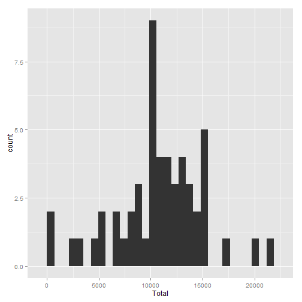
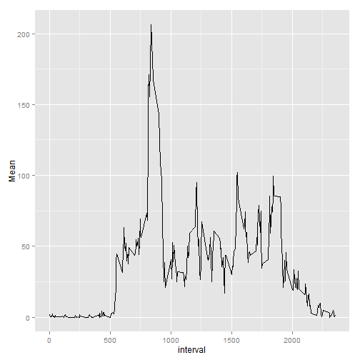
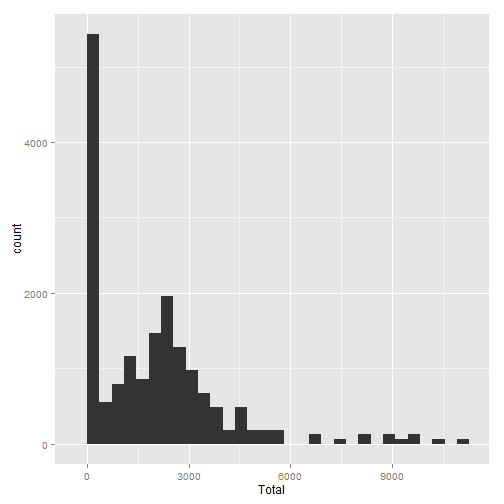
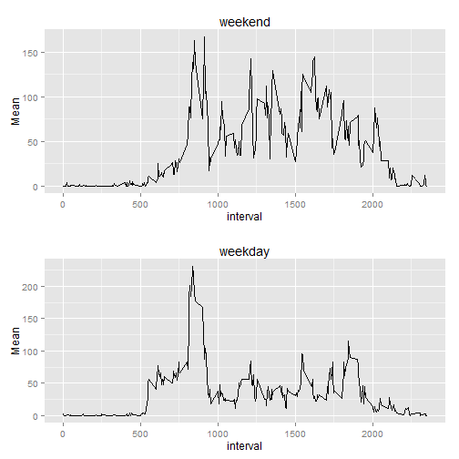

#Loading activity monitoring data

```r
setwd("d:/r/rr")
df <- read.csv("activity.csv",na.strings="NA")
nrow(df)
```

```
## [1] 17568
```
#Cleaning the data by removing NA and summarizing to get mean and median

```r
trdf <- df[!is.na(df$steps),]
library(plyr)
```

```
## Warning: package 'plyr' was built under R version 3.1.1
```

```r
summarize_act <- ddply(trdf, .(date), summarize, Total=sum(steps), Mean=mean(steps), Median = median(steps))
summarize_act
```

```
##          date Total    Mean Median
## 1  2012-10-02   126  0.4375      0
## 2  2012-10-03 11352 39.4167      0
## 3  2012-10-04 12116 42.0694      0
## 4  2012-10-05 13294 46.1597      0
## 5  2012-10-06 15420 53.5417      0
## 6  2012-10-07 11015 38.2465      0
## 7  2012-10-09 12811 44.4826      0
## 8  2012-10-10  9900 34.3750      0
## 9  2012-10-11 10304 35.7778      0
## 10 2012-10-12 17382 60.3542      0
## 11 2012-10-13 12426 43.1458      0
## 12 2012-10-14 15098 52.4236      0
## 13 2012-10-15 10139 35.2049      0
## 14 2012-10-16 15084 52.3750      0
## 15 2012-10-17 13452 46.7083      0
## 16 2012-10-18 10056 34.9167      0
## 17 2012-10-19 11829 41.0729      0
## 18 2012-10-20 10395 36.0938      0
## 19 2012-10-21  8821 30.6285      0
## 20 2012-10-22 13460 46.7361      0
## 21 2012-10-23  8918 30.9653      0
## 22 2012-10-24  8355 29.0104      0
## 23 2012-10-25  2492  8.6528      0
## 24 2012-10-26  6778 23.5347      0
## 25 2012-10-27 10119 35.1354      0
## 26 2012-10-28 11458 39.7847      0
## 27 2012-10-29  5018 17.4236      0
## 28 2012-10-30  9819 34.0938      0
## 29 2012-10-31 15414 53.5208      0
## 30 2012-11-02 10600 36.8056      0
## 31 2012-11-03 10571 36.7049      0
## 32 2012-11-05 10439 36.2465      0
## 33 2012-11-06  8334 28.9375      0
## 34 2012-11-07 12883 44.7326      0
## 35 2012-11-08  3219 11.1771      0
## 36 2012-11-11 12608 43.7778      0
## 37 2012-11-12 10765 37.3785      0
## 38 2012-11-13  7336 25.4722      0
## 39 2012-11-15    41  0.1424      0
## 40 2012-11-16  5441 18.8924      0
## 41 2012-11-17 14339 49.7882      0
## 42 2012-11-18 15110 52.4653      0
## 43 2012-11-19  8841 30.6979      0
## 44 2012-11-20  4472 15.5278      0
## 45 2012-11-21 12787 44.3993      0
## 46 2012-11-22 20427 70.9271      0
## 47 2012-11-23 21194 73.5903      0
## 48 2012-11-24 14478 50.2708      0
## 49 2012-11-25 11834 41.0903      0
## 50 2012-11-26 11162 38.7569      0
## 51 2012-11-27 13646 47.3819      0
## 52 2012-11-28 10183 35.3576      0
## 53 2012-11-29  7047 24.4688      0
```

```r
totalmean <- mean(summarize_act$Total)
totalmean
```

```
## [1] 10766
```

```r
totalmedian <- median(summarize_act$Total)
totalmedian
```

```
## [1] 10765
```
#Draw histogram and plot

```r
library(ggplot2)
```

```
## Warning: package 'ggplot2' was built under R version 3.1.1
```

```r
ggplot(summarize_act,aes(x=Total)) + geom_histogram()
```

```
## stat_bin: binwidth defaulted to range/30. Use 'binwidth = x' to adjust this.
```

 

```r
summarize_int <- ddply(trdf, .(interval), summarize, Total=sum(steps), Mean=mean(steps), Median = median(steps))
ggplot(summarize_int,aes(x=interval,y=Mean)) + geom_line()
```

 

```r
#Maximum value
summarize_int[summarize_int$Mean==max(summarize_int$Mean),]
```

```
##     interval Total  Mean Median
## 104      835 10927 206.2     19
```

#values with NA

```r
nrow(df[is.na(df),])
```

```
## [1] 2304
```

```r
md <- merge(df,summarize_int,all=FALSE)
#impute.mean <- function(x,y) replace(x, is.na(x), y)
for (i in 1:nrow(md))
  {

  if (is.na(md$steps[i]))
    {
     md$steps[i] <- md$Mean[i]
     cat(md$steps[i])
    }
  }
```

```
## 1.7171.7171.7171.7171.7171.7171.7171.7170.33960.33960.33960.33960.33960.33960.33960.33960.13210.13210.13210.13210.13210.13210.13210.13210.15090.15090.15090.15090.15090.15090.15090.15090.075470.075470.075470.075470.075470.075470.075470.075472.0942.0942.0942.0942.0942.0942.0942.0940.52830.52830.52830.52830.52830.52830.52830.52830.86790.86790.86790.86790.86790.86790.86790.8679000000001.4721.4721.4721.4721.4721.4721.4721.4720.30190.30190.30190.30190.30190.30190.30190.30190.13210.13210.13210.13210.13210.13210.13210.13210.32080.32080.32080.32080.32080.32080.32080.32080.67920.67920.67920.67920.67920.67920.67920.67920.15090.15090.15090.15090.15090.15090.15090.15090.33960.33960.33960.33960.33960.33960.33960.3396000000001.1131.1131.1131.1131.1131.1131.1131.1131.831.831.831.831.831.831.831.830.16980.16980.16980.16980.16980.16980.16980.16980.16980.16980.16980.16980.16980.16980.16980.16980.37740.37740.37740.37740.37740.37740.37740.37740.26420.26420.26420.26420.26420.26420.26420.26420000000000000000000000001.1321.1321.1321.1321.1321.1321.1321.13200000000000000000.13210.13210.13210.13210.13210.13210.13210.1321000000000.22640.22640.22640.22640.22640.22640.22640.226400000000000000001.5471.5471.5471.5471.5471.5471.5471.5470.94340.94340.94340.94340.94340.94340.94340.9434000000000000000000000000000000000.20750.20750.20750.20750.20750.20750.20750.20750.62260.62260.62260.62260.62260.62260.62260.62261.6231.6231.6231.6231.6231.6231.6231.6230.58490.58490.58490.58490.58490.58490.58490.58490.49060.49060.49060.49060.49060.49060.49060.49060.075470.075470.075470.075470.075470.075470.075470.0754700000000000000001.1891.1891.1891.1891.1891.1891.1891.1890.94340.94340.94340.94340.94340.94340.94340.94342.5662.5662.5662.5662.5662.5662.5662.566000000000.33960.33960.33960.33960.33960.33960.33960.33960.35850.35850.35850.35850.35850.35850.35850.35854.1134.1134.1134.1134.1134.1134.1134.1130.66040.66040.66040.66040.66040.66040.66040.66043.4913.4913.4913.4913.4913.4913.4913.4910.83020.83020.83020.83020.83020.83020.83020.83023.1133.1133.1133.1133.1133.1133.1133.1131.1131.1131.1131.1131.1131.1131.1131.113000000001.5661.5661.5661.5661.5661.5661.5661.566333333332.2452.2452.2452.2452.2452.2452.2452.2453.3213.3213.3213.3213.3213.3213.3213.3212.9622.9622.9622.9622.9622.9622.9622.9622.0942.0942.0942.0942.0942.0942.0942.0946.0576.0576.0576.0576.0576.0576.0576.05716.0216.0216.0216.0216.0216.0216.0216.0218.3418.3418.3418.3418.3418.3418.3418.3439.4539.4539.4539.4539.4539.4539.4539.4544.4944.4944.4944.4944.4944.4944.4944.4931.4931.4931.4931.4931.4931.4931.4931.4949.2649.2649.2649.2649.2649.2649.2649.2653.7753.7753.7753.7753.7753.7753.7753.7763.4563.4563.4563.4563.4563.4563.4563.4549.9649.9649.9649.9649.9649.9649.9649.9647.0847.0847.0847.0847.0847.0847.0847.0852.1552.1552.1552.1552.1552.1552.1552.1539.3439.3439.3439.3439.3439.3439.3439.3444.0244.0244.0244.0244.0244.0244.0244.0244.1744.1744.1744.1744.1744.1744.1744.1737.3637.3637.3637.3637.3637.3637.3637.3649.0449.0449.0449.0449.0449.0449.0449.0443.8143.8143.8143.8143.8143.8143.8143.8144.3844.3844.3844.3844.3844.3844.3844.3850.5150.5150.5150.5150.5150.5150.5150.5154.5154.5154.5154.5154.5154.5154.5154.5149.9249.9249.9249.9249.9249.9249.9249.9250.9850.9850.9850.9850.9850.9850.9850.9855.6855.6855.6855.6855.6855.6855.6855.6844.3244.3244.3244.3244.3244.3244.3244.3252.2652.2652.2652.2652.2652.2652.2652.2669.5569.5569.5569.5569.5569.5569.5569.5557.8557.8557.8557.8557.8557.8557.8557.8556.1556.1556.1556.1556.1556.1556.1556.1573.3873.3873.3873.3873.3873.3873.3873.3868.2168.2168.2168.2168.2168.2168.2168.21129.4129.4129.4129.4129.4129.4129.4129.4157.5157.5157.5157.5157.5157.5157.5157.5171.2171.2171.2171.2171.2171.2171.2171.2155.4155.4155.4155.4155.4155.4155.4155.4177.3177.3177.3177.3177.3177.3177.3177.3206.2206.2206.2206.2206.2206.2206.2206.2195.9195.9195.9195.9195.9195.9195.9195.9179.6179.6179.6179.6179.6179.6179.6179.6183.4183.4183.4183.4183.4183.4183.4183.4167167167167167167167167143.5143.5143.5143.5143.5143.5143.5143.5124124124124124124124124109.1109.1109.1109.1109.1109.1109.1109.1108.1108.1108.1108.1108.1108.1108.1108.1103.7103.7103.7103.7103.7103.7103.7103.795.9695.9695.9695.9695.9695.9695.9695.9666.2166.2166.2166.2166.2166.2166.2166.2145.2345.2345.2345.2345.2345.2345.2345.2324.7924.7924.7924.7924.7924.7924.7924.7938.7538.7538.7538.7538.7538.7538.7538.7534.9834.9834.9834.9834.9834.9834.9834.9821.0621.0621.0621.0621.0621.0621.0621.0640.5740.5740.5740.5740.5740.5740.5740.5726.9826.9826.9826.9826.9826.9826.9826.9842.4242.4242.4242.4242.4242.4242.4242.4252.6652.6652.6652.6652.6652.6652.6652.6638.9238.9238.9238.9238.9238.9238.9238.9250.7950.7950.7950.7950.7950.7950.7950.7944.2844.2844.2844.2844.2844.2844.2844.2837.4237.4237.4237.4237.4237.4237.4237.4234.734.734.734.734.734.734.734.728.3428.3428.3428.3428.3428.3428.3428.3425.0925.0925.0925.0925.0925.0925.0925.0931.9431.9431.9431.9431.9431.9431.9431.9431.3631.3631.3631.3631.3631.3631.3631.3629.6829.6829.6829.6829.6829.6829.6829.6821.3221.3221.3221.3221.3221.3221.3221.3225.5525.5525.5525.5525.5525.5525.5525.5528.3828.3828.3828.3828.3828.3828.3828.3826.4726.4726.4726.4726.4726.4726.4726.4733.4333.4333.4333.4333.4333.4333.4333.4349.9849.9849.9849.9849.9849.9849.9849.9842.0442.0442.0442.0442.0442.0442.0442.0444.644.644.644.644.644.644.644.646.0446.0446.0446.0446.0446.0446.0446.0459.1959.1959.1959.1959.1959.1959.1959.1963.8763.8763.8763.8763.8763.8763.8763.8787.787.787.787.787.787.787.787.794.8594.8594.8594.8594.8594.8594.8594.8592.7792.7792.7792.7792.7792.7792.7792.7763.463.463.463.463.463.463.463.450.1750.1750.1750.1750.1750.1750.1750.1754.4754.4754.4754.4754.4754.4754.4754.4732.4232.4232.4232.4232.4232.4232.4232.4226.5326.5326.5326.5326.5326.5326.5326.5337.7437.7437.7437.7437.7437.7437.7437.7445.0645.0645.0645.0645.0645.0645.0645.0667.2867.2867.2867.2867.2867.2867.2867.2842.3442.3442.3442.3442.3442.3442.3442.3439.8939.8939.8939.8939.8939.8939.8939.8943.2643.2643.2643.2643.2643.2643.2643.2640.9840.9840.9840.9840.9840.9840.9840.9846.2546.2546.2546.2546.2546.2546.2546.2556.4356.4356.4356.4356.4356.4356.4356.4342.7542.7542.7542.7542.7542.7542.7542.7525.1325.1325.1325.1325.1325.1325.1325.1339.9639.9639.9639.9639.9639.9639.9639.9653.5553.5553.5553.5553.5553.5553.5553.5547.3247.3247.3247.3247.3247.3247.3247.3260.8160.8160.8160.8160.8160.8160.8160.8155.7555.7555.7555.7555.7555.7555.7555.7551.9651.9651.9651.9651.9651.9651.9651.9643.5843.5843.5843.5843.5843.5843.5843.5848.748.748.748.748.748.748.748.735.4735.4735.4735.4735.4735.4735.4735.4737.5537.5537.5537.5537.5537.5537.5537.5541.8541.8541.8541.8541.8541.8541.8541.8527.5127.5127.5127.5127.5127.5127.5127.5117.1117.1117.1117.1117.1117.1117.1117.1126.0826.0826.0826.0826.0826.0826.0826.0843.6243.6243.6243.6243.6243.6243.6243.6243.7743.7743.7743.7743.7743.7743.7743.7730.0230.0230.0230.0230.0230.0230.0230.0236.0836.0836.0836.0836.0836.0836.0836.0835.4935.4935.4935.4935.4935.4935.4935.4938.8538.8538.8538.8538.8538.8538.8538.8545.9645.9645.9645.9645.9645.9645.9645.9647.7547.7547.7547.7547.7547.7547.7547.7548.1348.1348.1348.1348.1348.1348.1348.1365.3265.3265.3265.3265.3265.3265.3265.3282.9182.9182.9182.9182.9182.9182.9182.9198.6698.6698.6698.6698.6698.6698.6698.66102.1102.1102.1102.1102.1102.1102.1102.183.9683.9683.9683.9683.9683.9683.9683.9662.1362.1362.1362.1362.1362.1362.1362.1364.1364.1364.1364.1364.1364.1364.1364.1374.5574.5574.5574.5574.5574.5574.5574.5563.1763.1763.1763.1763.1763.1763.1763.1756.9156.9156.9156.9156.9156.9156.9156.9159.7759.7759.7759.7759.7759.7759.7759.7743.8743.8743.8743.8743.8743.8743.8743.8738.5738.5738.5738.5738.5738.5738.5738.5744.6644.6644.6644.6644.6644.6644.6644.6645.4545.4545.4545.4545.4545.4545.4545.4546.2146.2146.2146.2146.2146.2146.2146.2143.6843.6843.6843.6843.6843.6843.6843.6846.6246.6246.6246.6246.6246.6246.6246.6256.356.356.356.356.356.356.356.350.7250.7250.7250.7250.7250.7250.7250.7261.2361.2361.2361.2361.2361.2361.2361.2372.7272.7272.7272.7272.7272.7272.7272.7278.9478.9478.9478.9478.9478.9478.9478.9468.9468.9468.9468.9468.9468.9468.9468.9459.6659.6659.6659.6659.6659.6659.6659.6675.0975.0975.0975.0975.0975.0975.0975.0956.5156.5156.5156.5156.5156.5156.5156.5134.7734.7734.7734.7734.7734.7734.7734.7737.4537.4537.4537.4537.4537.4537.4537.4540.6840.6840.6840.6840.6840.6840.6840.6858.0258.0258.0258.0258.0258.0258.0258.0274.774.774.774.774.774.774.774.785.3285.3285.3285.3285.3285.3285.3285.3259.2659.2659.2659.2659.2659.2659.2659.2667.7767.7767.7767.7767.7767.7767.7767.7777.777.777.777.777.777.777.777.774.2574.2574.2574.2574.2574.2574.2574.2585.3485.3485.3485.3485.3485.3485.3485.3499.4599.4599.4599.4599.4599.4599.4599.4586.5886.5886.5886.5886.5886.5886.5886.5885.685.685.685.685.685.685.685.684.8784.8784.8784.8784.8784.8784.8784.8777.8377.8377.8377.8377.8377.8377.8377.8358.0458.0458.0458.0458.0458.0458.0458.0453.3653.3653.3653.3653.3653.3653.3653.3636.3236.3236.3236.3236.3236.3236.3236.3220.7220.7220.7220.7220.7220.7220.7220.7227.427.427.427.427.427.427.427.440.0240.0240.0240.0240.0240.0240.0240.0230.2130.2130.2130.2130.2130.2130.2130.2125.5525.5525.5525.5525.5525.5525.5525.5545.6645.6645.6645.6645.6645.6645.6645.6633.5333.5333.5333.5333.5333.5333.5333.5319.6219.6219.6219.6219.6219.6219.6219.6219.0219.0219.0219.0219.0219.0219.0219.0219.3419.3419.3419.3419.3419.3419.3419.3433.3433.3433.3433.3433.3433.3433.3433.3426.8126.8126.8126.8126.8126.8126.8126.8121.1721.1721.1721.1721.1721.1721.1721.1727.327.327.327.327.327.327.327.321.3421.3421.3421.3421.3421.3421.3421.3419.5519.5519.5519.5519.5519.5519.5519.5521.3221.3221.3221.3221.3221.3221.3221.3232.332.332.332.332.332.332.332.320.1520.1520.1520.1520.1520.1520.1520.1515.9415.9415.9415.9415.9415.9415.9415.9417.2317.2317.2317.2317.2317.2317.2317.2323.4523.4523.4523.4523.4523.4523.4523.4519.2519.2519.2519.2519.2519.2519.2519.2512.4512.4512.4512.4512.4512.4512.4512.458.0198.0198.0198.0198.0198.0198.0198.01914.6614.6614.6614.6614.6614.6614.6614.6616.316.316.316.316.316.316.316.38.6798.6798.6798.6798.6798.6798.6798.6797.7927.7927.7927.7927.7927.7927.7927.7928.1328.1328.1328.1328.1328.1328.1328.1322.6232.6232.6232.6232.6232.6232.6232.6231.4531.4531.4531.4531.4531.4531.4531.4533.6793.6793.6793.6793.6793.6793.6793.6794.8114.8114.8114.8114.8114.8114.8114.8118.5098.5098.5098.5098.5098.5098.5098.5097.0757.0757.0757.0757.0757.0757.0757.0758.6988.6988.6988.6988.6988.6988.6988.6989.7559.7559.7559.7559.7559.7559.7559.7552.2082.2082.2082.2082.2082.2082.2082.2080.32080.32080.32080.32080.32080.32080.32080.32080.11320.11320.11320.11320.11320.11320.11320.11321.6041.6041.6041.6041.6041.6041.6041.6044.6044.6044.6044.6044.6044.6044.6044.6043.3023.3023.3023.3023.3023.3023.3023.3022.8492.8492.8492.8492.8492.8492.8492.849000000000.83020.83020.83020.83020.83020.83020.83020.83020.96230.96230.96230.96230.96230.96230.96230.96231.5851.5851.5851.5851.5851.5851.5851.5852.6042.6042.6042.6042.6042.6042.6042.6044.6984.6984.6984.6984.6984.6984.6984.6983.3023.3023.3023.3023.3023.3023.3023.3020.64150.64150.64150.64150.64150.64150.64150.64150.22640.22640.22640.22640.22640.22640.22640.22641.0751.0751.0751.0751.0751.0751.0751.075
```

```r
newmd <- md
head(newmd)
```

```
##   interval steps       date Total  Mean Median
## 1        0 1.717 2012-10-01    91 1.717      0
## 2        0 0.000 2012-11-23    91 1.717      0
## 3        0 0.000 2012-10-28    91 1.717      0
## 4        0 0.000 2012-11-06    91 1.717      0
## 5        0 0.000 2012-11-24    91 1.717      0
## 6        0 0.000 2012-11-15    91 1.717      0
```
## show mean and median with NA populated with mean

```r
summarize_act_new <- ddply(newmd, .(date), summarize, Total=sum(steps), Mean=mean(steps), Median = median(steps))

ggplot(newmd,aes(x=Total)) + geom_histogram()
```

```
## stat_bin: binwidth defaulted to range/30. Use 'binwidth = x' to adjust this.
```

 

```r
#summarize_act_new
totalmean_new <- mean(summarize_act_new$Total)
totalmean_new
```

```
## [1] 10766
```

```r
totalmedian_new <- median(summarize_act_new$Total)
totalmedian_new
```

```
## [1] 10766
```
##segregate weekend and weekday

```r
wkdaymd <- cbind(newmd,weekdays(as.Date(newmd$date)))
colnames(wkdaymd) <- c("interval","steps","date","Total","Mean","Median","wkday")
weekend <- subset(wkdaymd,(wkday=="Saturday"|wkday=="Sunday"))
weekday <- subset(wkdaymd,!(wkday=="Saturday"|wkday=="Sunday"))

summarize_int_wkend <- ddply(weekend, .(interval), summarize, Total=sum(steps), Mean=mean(steps), Median = median(steps))

summarize_int_wkday <- ddply(weekday, .(interval), summarize, Total=sum(steps), Mean=mean(steps), Median = median(steps))


p1 <- ggplot(summarize_int_wkend, aes(x=interval, y=Mean)) +
    geom_line() +
    ggtitle("weekend")

p2 <- ggplot(summarize_int_wkday, aes(x=interval, y=Mean)) +
    geom_line() +
    ggtitle("weekday")
## Code for multiplot taken from the book R-cookbook Winston Chang
multiplot <- function(..., plotlist=NULL, cols) {
    require(grid)

    # Make a list from the ... arguments and plotlist
    plots <- c(list(...), plotlist)

    numPlots = length(plots)

    # Make the panel
    plotCols = cols                          # Number of columns of plots
    plotRows = ceiling(numPlots/plotCols) # Number of rows needed, calculated from # of cols

    # Set up the page
    grid.newpage()
    pushViewport(viewport(layout = grid.layout(plotRows, plotCols)))
    vplayout <- function(x, y)
        viewport(layout.pos.row = x, layout.pos.col = y)

    # Make each plot, in the correct location
    for (i in 1:numPlots) {
        curRow = ceiling(i/plotCols)
        curCol = (i-1) %% plotCols + 1
        print(plots[[i]], vp = vplayout(curRow, curCol ))
    }

}

multiplot(p1, p2,cols=1)
```

```
## Loading required package: grid
```

 


